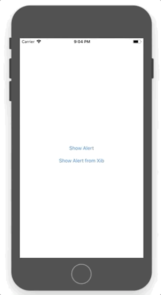

# Custom Dialogs in Swift

Based on the tutorials published on Medium: 
* [How to make Custom AlertView/DialogBox with Animation in Swift 3](https://medium.com/@aatish.rajkarnikar/how-to-make-custom-alertview-dialogbox-with-animation-in-swift-3-2852f4e6f311) by Aatish Rajkarnikar.
* [Swift 3 — Creating a custom view from a xib](https://medium.com/@brianclouser/swift-3-creating-a-custom-view-from-a-xib-ecdfe5b3a960) by Brian Clouser.

An example of how to create custom alerts/dialogs with the ability to customize them in any way. The project contains examples that demonstrate possible ways to design dialogs programmatically or using Interface Builder.
